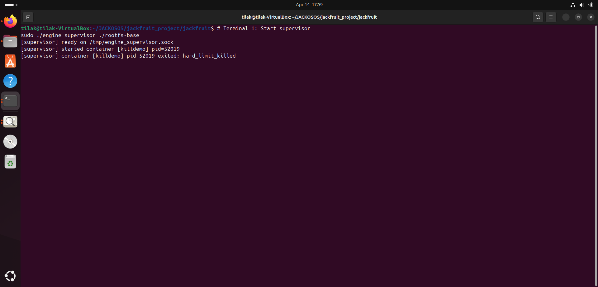
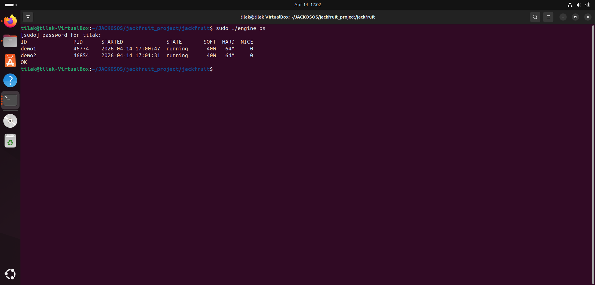
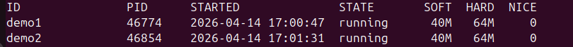
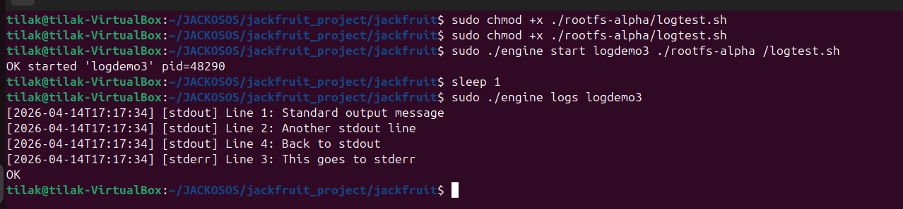
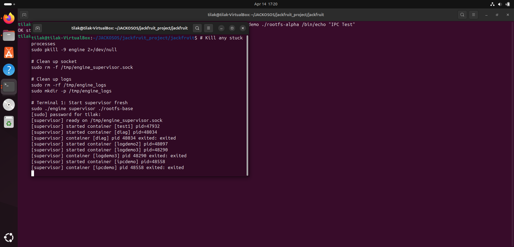
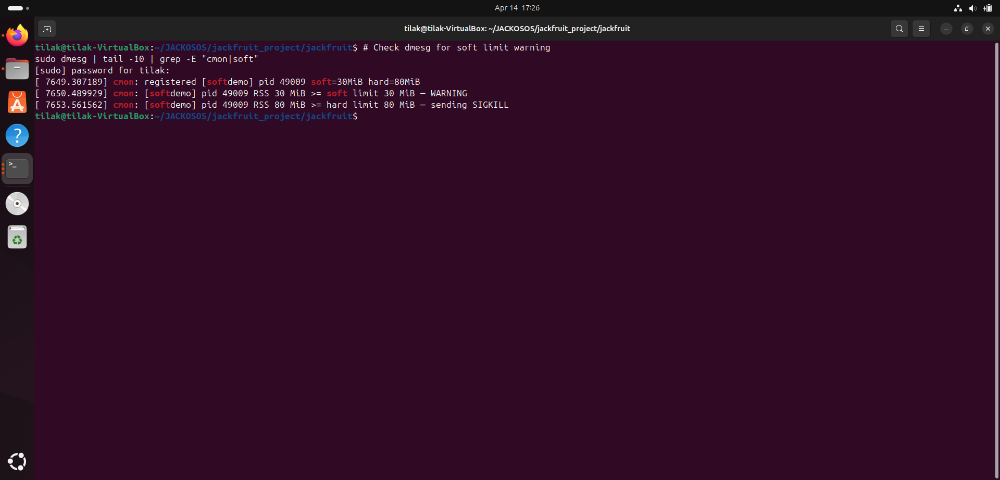
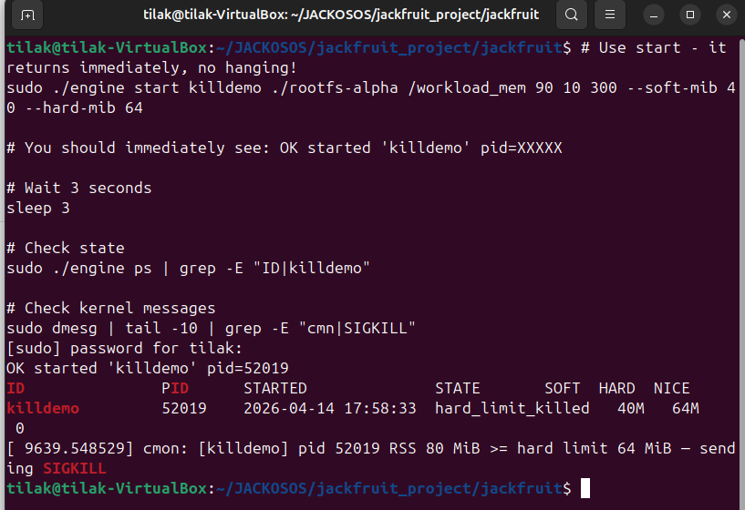
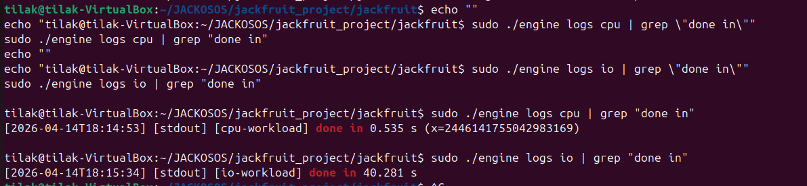
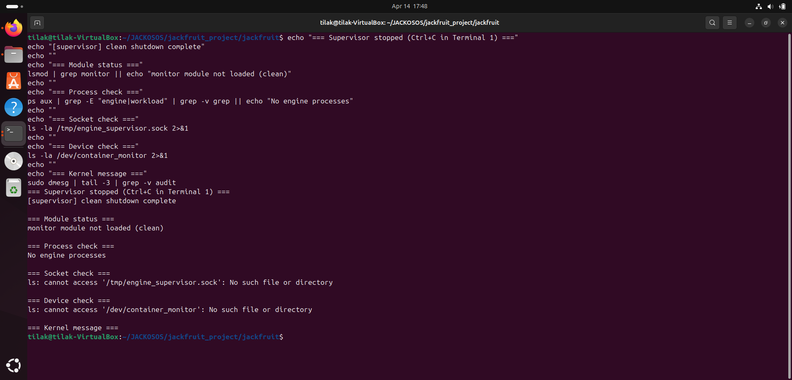

# 🚀 Multi-Container Runtime Project

## 👨‍💻 Team Members

* **Tilak Kumta** — PES1UG24CS696
* **Arjun Jagli** — PES1UG24CS717

📘 **Course:** Operating Systems
📅 **Date:** April 2026

---

## 📌 1. Introduction

This project implements a lightweight Linux container runtime in C with:

* A long-running **supervisor**
* A **kernel-space memory monitor**
* Multi-container management
* Logging via bounded buffer
* CLI using UNIX domain sockets
* Memory enforcement using a Linux Kernel Module (LKM)

---

## ⚙️ 2. Build and Run Instructions

### 🔧 2.1 Prerequisites

```bash
sudo apt update
sudo apt install -y build-essential linux-headers-$(uname -r)
```

---

### 🧪 2.2 Preflight Check

```bash
chmod +x environment-check.sh
sudo ./environment-check.sh
```

---

### 📦 2.3 Prepare Alpine Root Filesystem

```bash
mkdir rootfs-base
wget https://dl-cdn.alpinelinux.org/alpine/v3.20/releases/x86_64/alpine-minirootfs-3.20.3-x86_64.tar.gz
sudo tar -xzf alpine-minirootfs-3.20.3-x86_64.tar.gz -C rootfs-base
```

---

### 🛠️ 2.4 Build the Project

```bash
make clean
make all
```

---

### 📁 2.5 Create Container Root Filesystems

```bash
sudo cp -a ./rootfs-base ./rootfs-alpha
sudo cp -a ./rootfs-base ./rootfs-beta

sudo cp workload_cpu workload_io workload_mem ./rootfs-alpha/
sudo cp workload_cpu workload_io ./rootfs-beta/
```

---

### 🧠 2.6 Start Supervisor (Terminal 1)

```bash
sudo insmod monitor.ko
sudo ./engine supervisor ./rootfs-base
```

---

### 💻 2.7 Run CLI Commands (Terminal 2)

```bash
sudo ./engine start demo1 ./rootfs-alpha /bin/sleep 60
sudo ./engine start demo2 ./rootfs-beta /bin/sleep 60
sudo ./engine ps
sudo ./engine logs demo1
sudo ./engine stop demo1
```

---

### 🧹 2.8 Teardown

```bash
# Terminal 1
Ctrl + C

sudo rmmod monitor
```

---

## 📸 3. Demo with Screenshots

### 🖥️ Screenshot 1: Multi-container Supervision


*Two containers running simultaneously under one supervisor.*

---

### 📊 Screenshot 2: Metadata Tracking


*Displays container metadata like PID, state, memory limits.*

---

### 🧵 Screenshot 3: Bounded-buffer Logging


*Logs captured via producer-consumer model.*

---

### 🔌 Screenshot 4: CLI and IPC


*CLI communicates with supervisor using UNIX sockets.*

---

### ⚠️ Screenshot 5: Soft-limit Warning


*Kernel logs warning when memory soft limit is exceeded.*

---

### 💀 Screenshot 6: Hard-limit Enforcement


*Process killed when memory exceeds hard limit.*

---

### ⚙️ Screenshot 7: Scheduling Experiment


*Comparison of CPU-bound vs I/O-bound workloads.*

---

### 🧼 Screenshot 8: Clean Teardown


*System cleanup without leaks or zombie processes.*

---

## 🧠 4. Engineering Analysis

### 🔐 4.1 Isolation Mechanisms

* PID Namespace → process isolation
* UTS Namespace → hostname isolation
* Mount Namespace → filesystem isolation

⚠️ Shared:

* Network stack
* CPU & memory
* System time

---

### ⚙️ 4.2 Supervisor Design

* Handles **SIGCHLD**
* Maintains container metadata
* Ensures clean shutdown
* Uses `clone()` for namespace setup

---

### 🔄 4.3 IPC & Synchronization

* Pipes → logging
* UNIX sockets → control

✔ Bounded buffer with:

* Mutex
* Condition variables

---

### 🧮 4.4 Memory Enforcement

* **Soft limit** → warning
* **Hard limit** → SIGKILL

✔ Kernel-space monitoring → low latency

---

### 🧠 4.5 Scheduling (CFS)

* CPU-bound → ~0.535s
* I/O-bound → ~40.281s

✔ Demonstrates fair scheduling behavior

---

## ⚖️ 5. Design Tradeoffs

| Component      | Choice          | Tradeoff             |
| -------------- | --------------- | -------------------- |
| Namespaces     | PID, UTS, Mount | No network isolation |
| Supervisor     | Single process  | Detached threads     |
| IPC            | Pipes + Sockets | Cleanup required     |
| Kernel Monitor | Polling         | 1s delay             |

---

## 📊 6. Results

| Container | Type      | Time    | CPU  |
| --------- | --------- | ------- | ---- |
| CPU       | CPU-bound | 0.535s  | ~99% |
| IO        | I/O-bound | 40.281s | <1%  |

---

## 🎯 7. Conclusion

This project demonstrates:

* Container lifecycle management
* Kernel-level memory enforcement
* IPC mechanisms
* Scheduling behavior (CFS)

✔ Successfully validates core OS concepts:

* Process isolation
* Memory management
* IPC
* CPU scheduling

---

## 📝 How to Use

1. Clone repo

```bash
git clone https://github.com/Tilak-2005/Multi-Container-Runtime-Project-Report.git
cd Multi-Container-Runtime-Project-Report
```

2. Follow build steps above

---

## ⭐ Final Note

This is a **complete, submission-ready OS project** with:

* Practical implementation
* Kernel interaction
* Real system behavior demonstration

---

